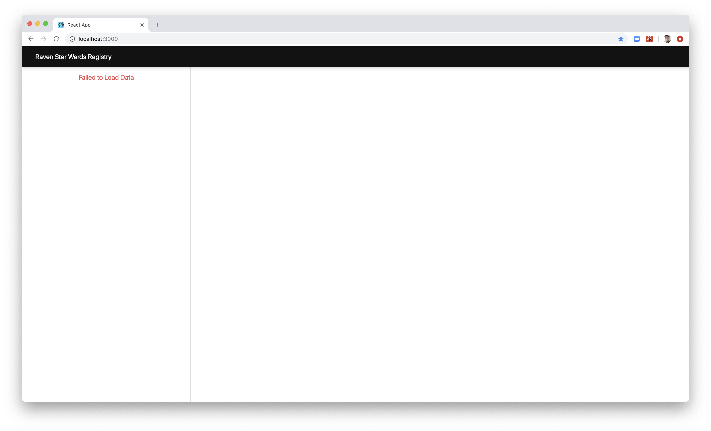
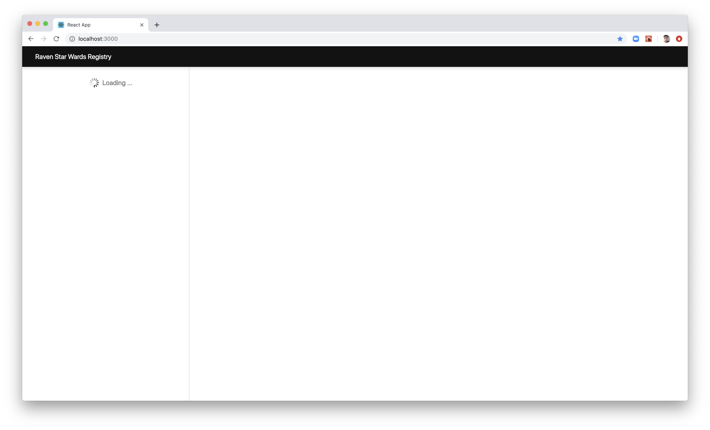
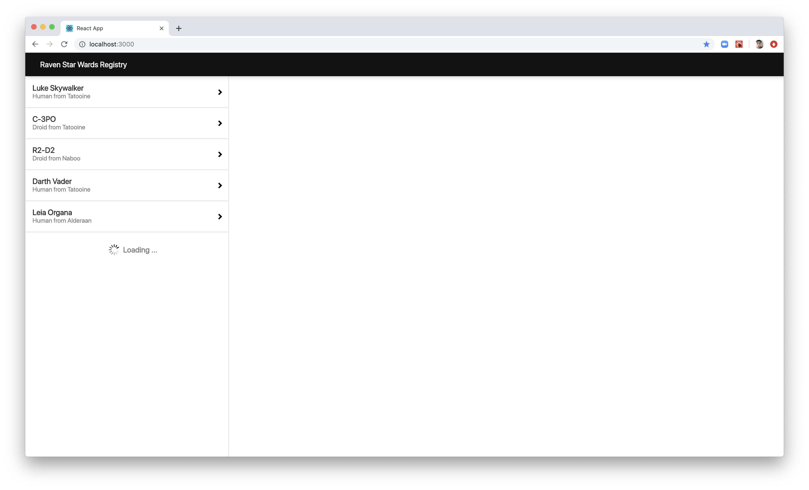
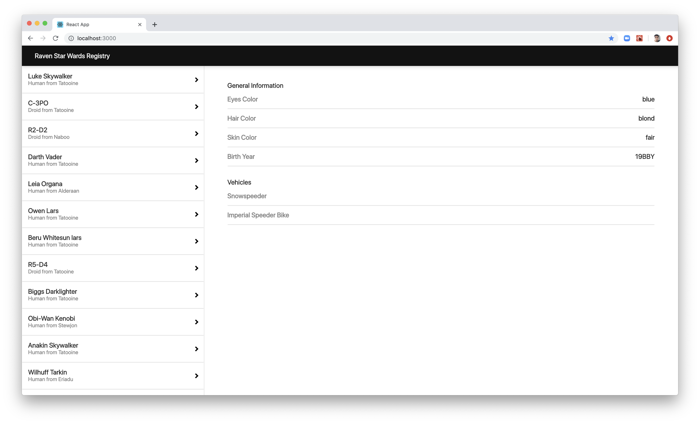

# Ravn Star Wars

This repository contains the source code for the Ravn Star Wars GraphQL Code Challenge provided by Ravn.

## Setup

This project was bootstrapped with [Create React App](https://github.com/facebook/create-react-app).
Make sure you have `Node JS` and `create-react-app` installed on you local.

## Available Scripts

Clone the repository. In the project directory, you can run:

### `npm install`

Install all dependencies for the project based on `package.json` file. 
The project will create a `package-lock.json`.

### `npm start`

After install dependencies you can run the app in the development mode. 
Open [http://localhost:3000](http://localhost:3000) to view it in the browser.

The page will reload if you make edits. 
You will also see any lint errors in the console.

## Ravn Star Wars Registry

This project was developed as Code Challenge provided by Ravn, It use the [Ravn Star Wars](https://swapi-graphql-ravn.herokuapp.com/) API that allow get all required information for the main purpose of project: Generate a sidebar with the information about all people from Star Wars, see their specie and their origin place. Also we can access to the specific information about a certain Person and their characteristics like their eyes color, skin color, hair color, birth year and the posibility to see if the person has vehicles or not.

### This is the app when it can not get the initial required information

### This is the app when is loading initial data

### This is the app when has loaded the first 5 people

### This is the app when all was loaded correctly

Additional to this, the project is using [Eslint](https://eslint.org/docs/user-guide/getting-started) like tool for identifying and reporting on patterns found in ECMAScript/JavaScript code, with the goal of making code more consistent and avoiding bugs.

## Tecnologies used
- Node JS. 
- React JS. 

and some packages like:
- graphql. 
- apollo-boost. 
- node-sass. 
